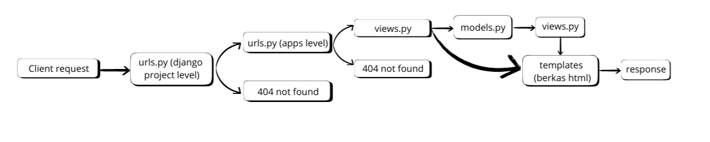
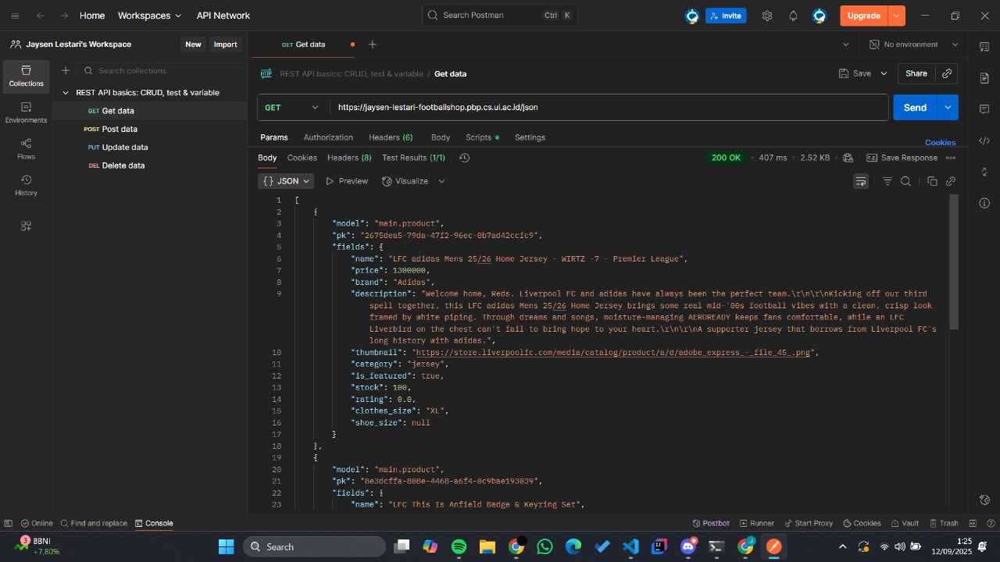
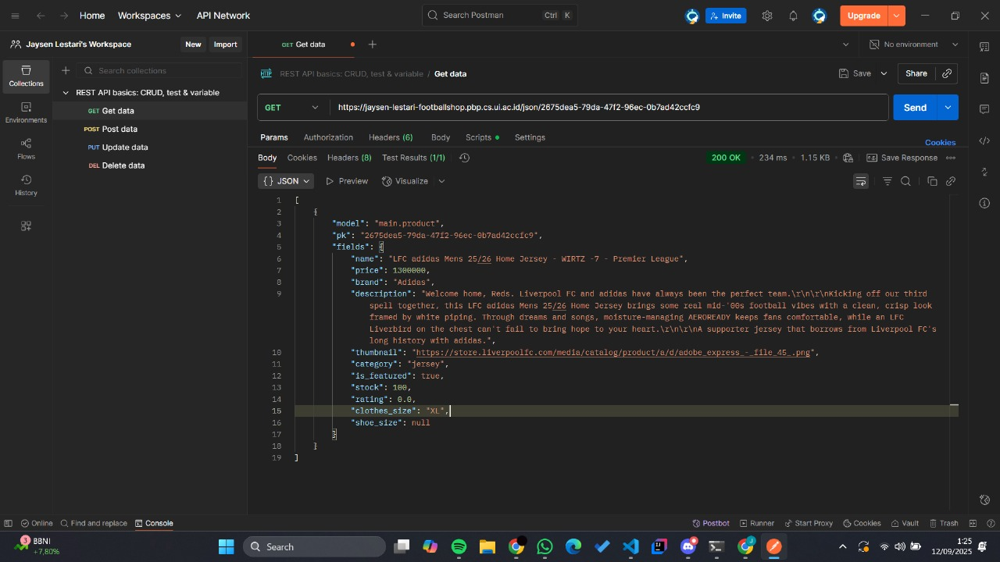
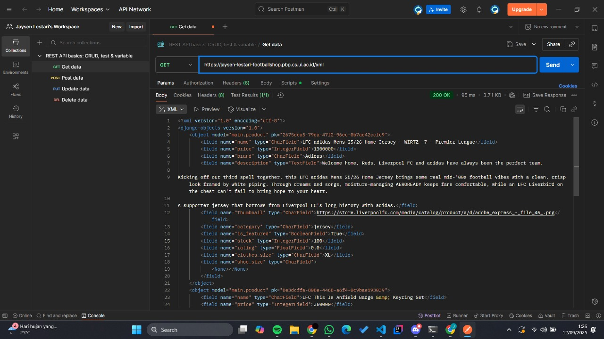
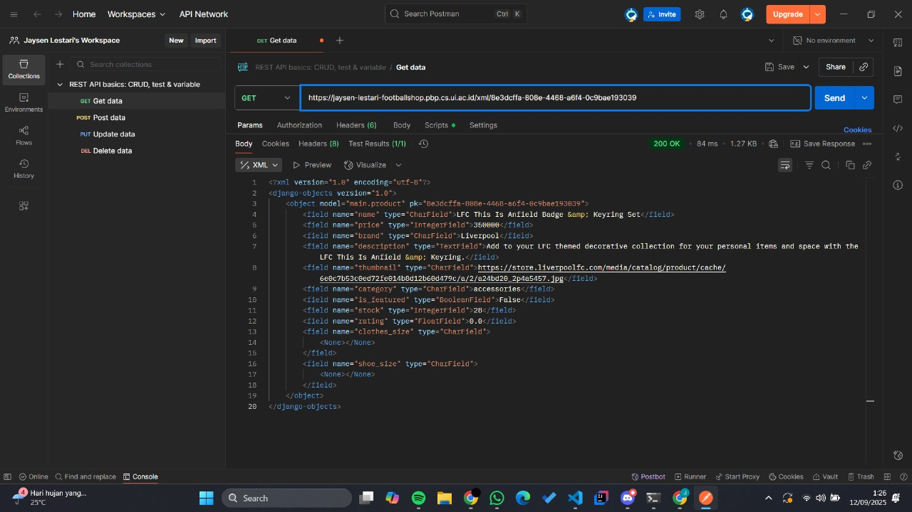

## TI2
1. Cara saya mengimplementasikannya adalah dengan cara mengikuti prosedur yang diberikan dari tutorial0 yaitu mulai dari membuat repository dan menyiapkan dependencies serta membuat project django. Setelah itu saya melakukan registrasi appnya di dalam settings.py. Kemudian membuat models Product sesuai spesifikasi minimal yang diberikan dengan menambahkan beberapa atribut. Kemudian saya melakukan routing agar dapat menjalankan main untuk menampilkan views.py
2. Berdasarkan gambar dibawah dapat dilihat bahwa pertama kali setelah client melakukan request, request akan diteruskan ke urls.py pada level django project dimana akan dilakukan pengecekan endpoint misalnya pada kode ini jika endpoint nya adalah "/admin" maka akan diteruskan ke admin.site.urls, sedangkan sisanya akan langsung diteruskan ke main.urls dikarenakan path yang dicocokkan adalah strings kosong, jika pada case lain request endpoint dari client tidak match dengan urls.py maka aplikasi akan melempar 404 error not found. Jika berhasil ditemukan endpoint yang cocok, maka request selanjutnya akan masuk ke app level URLconf, misal ketika kita melakukan request ke http://IP:Port/ maka selanjutnya akan diteruskan ke main/urls.py, kemudian jika tidak ada endpoint yang match maka aplikasi akan kembali melempar respone 404 error not found, jika ditemukan maka apps akan meneruskan ke views.py dan views.py dapat memanggil models.py jika dibutuhkan untuk mengambil data atau memproses data dari database setelah itu maka akan kembali ke views.py dimana selanjutnya jika aplikasi akan melakukan return response berupa html maka views akan me-render templates terlebih dahulu, sebelum mengembalikan response kepada client. Dalam kode tugas ini adalah menampilkan data nama, npm, dan kelas. 
3. settings.py adalah file konfigurasi utama dari sebuah proyek Django. Semua pengaturan yang mengendalikan jalannya aplikasi Django berada di file ini. settings.py berguna untuk menentukan struktur dasar proyek (BASE_DIR), mengatur mode deployment/production (DEBUG), mengatur akses host/domain (ALLOWED_HOST), mendaftarkan aplikasi (INSTALLED_APPS), konfigurasi database (DATABASES), dll (https://www.geeksforgeeks.org/python/django-settings-file-step-by-step-explanation/)
4. Migrasi database di Django adalah proses yang mengubah perubahan pada model di models.py menjadi perintah SQL yang dijalankan pada database. Ketika developer menambahkan atau mengubah model, Django menggunakan perintah makemigrations untuk membuat file migrasi yang berisi instruksi Python tentang perubahan struktur tabel. Selanjutnya, perintah migrate akan mengeksekusi file migrasi tersebut menjadi query SQL sesuai dengan database yang digunakan, misalnya membuat tabel baru atau menambahkan kolom. Django juga mencatat semua migrasi yang sudah diterapkan dalam tabel khusus django_migrations, sehingga sistem dapat melacak, menghindari duplikasi, dan memungkinkan rollback jika diperlukan.
5. Menurut saya alasan utama adalah karena framework django memakai bahasa python, dimana bahasa python sangat mudah untuk dipelajari dan bukan merupakan bahasa pemrograman yang memiliki syntax yang sulit dimengerti. Selain itu, Django menggunakan pola arsitektur MTV (Model-Template-View) yang membantu pemula memahami alur kerja aplikasi web secara terstruktur, mulai dari request masuk, pemrosesan data, hingga menghasilkan response ke pengguna. Kemudian di matakuliah ini juga kita akan mempelajari framework mobile, django memiliki salah satu keunggulan di sisi ini yaitu dapat langsung digunakan sebagai backend dari aplikasi mobile, sehingga hal ini juga mempermudah.
6. Tidak ada
---
## TI3
1. Data delivery adalah proses pengiriman suatu data dari sistem yang satu ke sistem lainnya. Proses ini diperlukan karena kita memerlukan komunikasi misalnya antar backend dengan frontend, menjamin datanya real time, lebih efisien dan akurat.
2. Menurut saya, json. Karena json memakai struktur key:value yang mudah dibaca. Selain itu ternyata hal itu membuat json lebih mudah diparsing terutama di javascript, membuatnya sangat cocok untuk API modern, aplikasi mobile, dan web services. Sebaliknya XML memakai struktur tree yang lebih susah dibaca dan kompleks, namun XML mendukung berbagai tipe data dan validasi dokumen yang lebih ketat. JSON lebih populer karena file lebih kecil, parsing lebih mudah, lebih aman dari beberapa serangan yang rentan pada XML, dan secara umum dirancang untuk mempermudah pertukaran data antar sistem. [source](https://aws.amazon.com/compare/the-difference-between-json-xml/) 
3. Method is_valid() digunakan untuk melakukan validasi input, method ini akan memeriksa apakah semua field di form terisi dengan data yang sesuai dengan format yang telah ditentukan (seperti length, tidak boleh kosong, dll). Sehingga dengan adanya method ini, akan ada validasi yang dilakukan terlebih dahulu terhadap data yang diisi user sebelum dikirim.
4. csrf_token adalah token unik yang dihasilkan oleh server dan disisipkan ke form. Saat form dikirim, Django akan melakukan validasi terhadap token tersebut. Hal ini mencegah penyerang membuat request palsu yang tampak seolah-olah berasal dari korbannya. Jika kita tidak menambahkan csrf_token, penyerang bisa membuat form berbahaya di website lain yang secara otomatis mengirim request ke server django ketika user (yang sedang login di web kita) mengunjungi situs penyerang (client-side). Karena browser otomatis mengirim cookie session, server akan menganggap request tersebut sah. Sehingga tentu saja hal ini berbahaya, karena attacker bisa mengganti password atau melakukan hal merugikan user lainnya.

POC:
misal ada aplikasi yang memiliki fitur mengubah email di akun mereka, requestnya sebagai berikut:
```
POST /email/change HTTP/1.1
Host: vulnerable-website.com
Content-Type: application/x-www-form-urlencoded
Content-Length: 30
Cookie: session=yvthwsztyeQkAPzeQ5gHgTvlyxHfsAfE

email=wiener@normal-user.com
```
Dari request itu, yang dilakukan aplikasi tersebut hanyalah mengecek cookienya, tetapi tidak ada validasi token csrf. Sehingga attacker membuat sebuah html website berikut : 
```
<html>
    <body>
        <form action="https://vulnerable-website.com/email/change" method="POST">
            <input type="hidden" name="email" value="pwned@evil-user.net" />
        </form>
        <script>
            document.forms[0].submit();
        </script>
    </body>
</html> 
```

Jika korban mengunjungi website ini, maka dia akan mentrigger http request ke website dan browser akan otomatis menginclude session cookienya, sehingga emailnya langsung terganti. [source](https://portswigger.net/web-security/csrf)

5. Yang pertama saya lakukan adalah membuat form terlebih dahulu dan memahami apa yang dilakukan form tersebut, kemudian saya membuat 4 func dari masing" return data json dan xml, kemudian mengatur route untuk tiap endpoint serta membuat tampilan htmlnya.

6. tidak ada

ss-postman : 
1. 
2. 
3. 
4. 
---
## TI 4
1. Django AuthenticationForm adalah form bawaan yang digunakan untuk proses login user. Form ini secara otomatis memvalidasi username dan password yang dimasukkan, serta melakukan pemeriksaan tambahan terhadap atribut is_active pada model User. Field is_active adalah boolean yang menentukan apakah user boleh login atau tidak: jika is_active=True, user dengan kredensial yang benar bisa login, sedangkan jika is_active=False, login akan ditolak meskipun username dan password benar. Hal ini berguna untuk menonaktifkan akun sementara tanpa harus menghapusnya, misalnya ketika akun diblokir, belum verifikasi email, atau dinonaktifkan oleh admin.  ([source](https://docs.djangoproject.com/en/5.2/topics/auth/default/#django.contrib.auth.views.LoginView.authentication_form))

   Salah satu kekurangan form bawaan ini adalah fleksibilitasnya terbatas, jika ingin mengubah defaultn, misalnya memperbolehkan login untuk user inactive atau menambahkan aturan login khusus, kita perlu melakukan override pada method confirm_login_allowed(user) atau membuat subclass custom. Di sisi lain, kelebihan utama dari AuthenticationForm adalah memudahkan developer karena tidak perlu menulis fungsi login dari nol, validasi username, password, dan keamanan dasar seperti session management sudah ditangani Django, sehingga proses login menjadi cepat, aman, dan terintegrasi dengan sistem autentikasi bawaan Django.
2. Singkatnya, autentikasi adalah proses memverifikasi identitas user, sedangkan otorisasi adalah proses menentukan hak akses setelah dilakukan verifikasi. Django menyediakan sistem autentikasi dan otorisasi bawaan untuk mengelola login dan hak akses user. Untuk [autentikasi](https://docs.djangoproject.com/en/5.2/topics/auth/default/#authentication-in-web-requests), Django menggunakan form seperti AuthenticationForm untuk memvalidasi username dan password. Sistem ini menggunakan sessions dan middleware, sehingga setiap request memiliki atribut request.user yang menunjukkan user saat ini dan bisa dicek dengan is_authenticated. Untuk [otorisasi](https://docs.djangoproject.com/en/5.2/topics/auth/default/#permissions-and-authorization), Django menggunakan permissions yang bisa diterapkan ke user atau grup untuk menentukan hak akses, seperti melihat (view), menambah (add), mengubah (change), atau menghapus (delete) objek, bahkan bisa dikustomisasi per instance. 
3. Session menyimpan data di server, sehingga lebih aman dari manipulasi user dan cocok untuk informasi sensitif seperti user ID atau role, serta memudahkan kontrol waktu kedaluwarsa dan logout paksa, dibanding cookies yang menyimpan data di browser. Namun, cookies memiliki performance yang lebih bagus dibanding session, data size dari session juga lebih besar dari cookies. Dengan demikian, session cocok digunakan untuk autentikasi dan data penting, sedangkan cookies lebih cocok untuk hal yang kurang sensitive bagi user. ([source](https://www.geeksforgeeks.org/javascript/difference-between-session-and-cookies/))
4. Penggunaan cookies tidak selalu aman secara default karena bisa dicuri atau dimanipulasi melalui XSS atau jaringan tidak terenkripsi. Django menangani hal ini dengan [HttpOnly](https://docs.djangoproject.com/en/5.2/releases/1.4/#session-cookies-now-have-the-httponly-flag-by-default) atau [secure cookies](https://docs.djangoproject.com/en/5.2/topics/security/). sehingga cookie hanya berisi session id. Dengan konfigurasi ini, risiko pencurian data atau session hijacking bisa diminimalkan, tapi tetap disarankan menggunakan HTTPS.
5. Pertama saya memulai dari views.py terlebih dahulu dengan menerapkan fungsi registrasi, login, dan logout serta mengubah fungsi main dan create product untuk menyesuaikan dengan beberapa fitur-fitur tambahan seperti filter. Kemudian menambah decorator pada main dan create product agar user harus login terlebih dahulu, agar bisa mengakses endpoint tersebut. Kemudian setelah itu baru saya menambah path nya di main/urls.py serta menambah model user di models.py. Kemudian, baru saya mengubah beberapa templates dan menambah html file untuk login dan registrasi
---
## TI 5
1. Jika sebuah elemen HTML memiliki lebih dari satu aturan CSS yang berlaku, browser akan memilih gaya berdasarkan urutan prioritas (specificity) dari selector. Urutan tersebut dari yang paling tinggi hingga terendah adalah sebagai berikut:

   * Inline Style  
   Aturan yang ditulis langsung pada atribut style sebuah elemen memiliki prioritas paling tinggi. CSS jenis ini akan selalu diterapkan meskipun ada aturan lain yang ditulis di file CSS eksternal atau internal.

   * ID Selector          
   Prioritas kedua ditempati oleh selector ID, yang ditandai dengan tanda pagar (#idName). Karena ID bersifat unik untuk setiap elemen, aturan ini lebih kuat dibandingkan class, attribute, atau element selector.

   * Class dan Pseudo-class Selector  
   Selector class (.className) dan pseudo-class (misalnya :hover, :focus) berada di bawah ID dalam hal prioritas. Class biasanya digunakan untuk memberi gaya pada sekelompok elemen, sedangkan pseudo-class dipakai untuk kondisi tertentu.

   * Attribute Selector   
   Selector ini menargetkan elemen berdasarkan atribut yang dimiliki, misalnya input[type="text"]. Meskipun fleksibel, kekuatannya tetap berada di bawah class dan ID.

   * Element dan Pseudo-element Selector  
   Selector paling lemah adalah element (div, p, h1) dan pseudo-element (::before, ::after). Biasanya dipakai untuk mengatur gaya dasar dari elemen-elemen HTML.
src : [gfg](!https://www.geeksforgeeks.org/css/css-specificity/)
```
<!DOCTYPE html>
<html>
<head>
    <style type="text/css">
        h1 {
            background-color: red;
            color: white; /* element selector */
        }

        #second {
            background-color: black;
            color: white; /* ID selector */
        }

        .third {
            background-color: pink;
            color: blue; /* class selector */
        }

        #second1 {
            color: blue; /* ID selector */
        }

        .third1 {
            color: red; /* class selector */
        }
    </style>
</head>
<body>
    <h1 id="second" class="third">
        Prioritas selector ID lebih tinggi dibanding class dan elemen.
    </h1>

    <h1>
        Selector elemen memiliki prioritas terendah.
    </h1>

    <h1 class="third">
        Selector class lebih kuat dibanding selector elemen.
    </h1>

    <h2 style="color: green;" id="second1" class="third1">
        Inline style memiliki prioritas tertinggi.
    </h2>
</body>
</html>
```
2. Responsive design penting karena pengguna aplikasi web berasal dari berbagai perangkat dengan ukuran layar yang berbeda. Supaya tetap nyaman digunakan, tampilan aplikasi perlu menyesuaikan diri secara otomatis dengan perangkat tersebut.

   Contoh aplikasi yang sudah responsif adalah YouTube, Instagram, Twitter, atau LinkedIn, di mana tampilannya tetap rapi baik di PC maupun smartphone. Sebaliknya, aplikasi seperti scele belum responsif, karena ketika dibuka di HP masih menampilkan versi desktop yang menyulitkan pengguna.
3. Margin adalah jarak di luar elemen yang memisahkannya dari elemen lain. Contohnya margin-top: 12px; memberi jarak 12px dari elemen di atasnya.

   Border adalah garis pembatas di sekitar elemen yang bisa diatur ketebalan, warna, dan jenisnya. Misalnya border: 5px solid red; membuat garis merah tebal 5px.

   Padding adalah jarak di dalam elemen, antara konten dan border. Contohnya padding-bottom: 25px; memberi ruang 25px di bagian bawah konten sebelum border.
4. Secara umum, Flexbox dan Grid Layout adalah metode untuk mengatur tata letak elemen agar lebih mudah, terutama saat membuat website responsif.

   Flexbox digunakan untuk tata letak satu dimensi (baris atau kolom). Metode ini mempermudah pengaturan posisi dan ruang antar elemen dalam sebuah kontainer. Contoh penerapannya biasanya pada navigation bar.

   Grid Layout digunakan untuk tata letak dua dimensi (baris dan kolom sekaligus). Dengan grid, elemen dapat tersusun rapi dalam bentuk kotak-kotak. Contoh penggunaannya ada pada dashboard yang menampilkan banyak komponen dalam satu halaman.
5. Pertama-tama saya mengubah base.html dan menambah navbar.html, kemudian saya menambah file global.css dan sudah mengatur di settings.py terlebih dahulu. Kemudian baru saya membuat fungsi delete dan edit di views.py. Setelah itu saya mengatur url nya, kemudian baru memulai untuk mengganti tiap tampilan dari endpoint yg bs diakses oleh user.
---
## TI 6
1. Synchronous request adalah permintaan yang dijalankan secara berurutan, di mana program harus menunggu hingga suatu proses selesai sebelum melanjutkan ke langkah berikutnya. Dalam konteks web, ini berarti browser akan menunggu respons dari server terlebih dahulu sebelum pengguna bisa berinteraksi kembali dengan halaman, sehingga dapat membuat tampilan terasa lambat atau tidak responsif. Sebaliknya, asynchronous request memungkinkan proses berjalan di latar belakang tanpa menghentikan eksekusi kode lainnya. Dengan cara ini, pengguna tetap bisa berinteraksi dengan halaman sambil menunggu respons dari server. Asynchronous request umumnya digunakan dalam AJAX atau fungsi fetch() di JavaScript, karena memberikan pengalaman yang lebih cepat dan interaktif tanpa perlu memuat ulang seluruh halaman.
2. AJAX di Django bekerja dengan cara mengirim dan menerima data secara asinkron antara browser dan server tanpa perlu memuat ulang seluruh halaman. Alurnya dimulai ketika pengguna melakukan suatu aksi di halaman web (misalnya menekan tombol atau mengirim form). JavaScript kemudian menangkap aksi tersebut dan mengirim request AJAX ke server melalui fungsi seperti fetch() atau XMLHttpRequest, biasanya disertai dengan header khusus (X-Requested-With: XMLHttpRequest) agar Django dapat mengenali bahwa itu adalah permintaan AJAX.

   Di sisi server, Django memproses request tersebut melalui view yang sesuai, misalnya dengan memeriksa if request.headers.get('x-requested-with') == 'XMLHttpRequest'. Setelah memproses data (misalnya menyimpan ke database atau mengambil data tertentu), Django mengembalikan response dalam format JSON menggunakan JsonResponse. Respons ini kemudian diterima kembali oleh JavaScript di browser, yang akan memperbarui tampilan halaman (DOM) secara dinamis — misalnya menampilkan pesan toast, menambahkan elemen baru ke daftar, atau mengarahkan pengguna ke halaman lain — tanpa perlu melakukan reload seluruh halaman.

3. Keuntungan utama menggunakan AJAX dibandingkan dengan render biasa di Django adalah kemampuannya untuk memperbarui bagian tertentu dari halaman web tanpa harus memuat ulang seluruh halaman. Dengan AJAX, interaksi antara pengguna dan server menjadi lebih cepat dan responsif karena hanya data yang dibutuhkan saja yang dikirim dan diterima, bukan keseluruhan HTML. Sehingga halaman terasa lebih dinamis dan interaktif. Selain itu, AJAX memungkinkan pembuatan aplikasi web real-time seperti sistem komentar langsung, form validasi tanpa reload, atau dashboard yang menampilkan data terbaru secara otomatis

4. Untuk memastikan keamanan saat menggunakan AJAX pada fitur Login dan Register di Django, ada beberapa langkah penting yang perlu diterapkan:

   * selalu gunakan CSRF token di setiap permintaan AJAX POST. Django sudah menyediakan sistem CSRF bawaan, sehingga token ini harus dikirim melalui header (X-CSRFToken) atau disertakan di form agar server dapat memverifikasi bahwa permintaan benar-benar berasal dari situs yang sah, bukan dari eksternal.

   * gunakan validasi input yang ketat di sisi server, bukan hanya di sisi klien. Meskipun AJAX bisa memvalidasi form secara real-time, validasi di backend tetap penting untuk mencegah serangan seperti SQL Injection ataupun XSS.

    * gunakan response JSON yang aman dan hindari menampilkan detail error sensitif (seperti stack trace atau pesan debug) pada response AJAX. Cukup kirim pesan umum seperti “Invalid credentials” agar penyerang tidak mendapatkan informasi tambahan dari sistem.

5. AJAX berperan penting karena memungkinkan website memuat data secara dinamis tanpa perlu me-reload seluruh halaman. Teknologi ini membuat interaksi terasa lebih cepat dan halus, seperti saat Twitter menampilkan tweet baru atau Google melengkapi hasil pencarian secara otomatis. Dengan demikian, AJAX meningkatkan interaktivitas, kecepatan, dan efisiensi situs, sehingga memberikan pengalaman pengguna yang lebih responsif dan menyenangkan serta membantu mempertahankan perhatian pengunjung lebih lama. ([source](https://medium.com/@seo4ajax/is-ajax-the-solution-to-improve-ux-e1a21c936abd))
